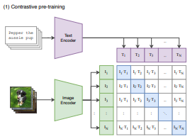
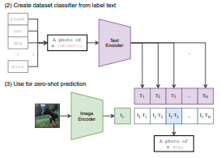

# CLIP

  

CLIP helps us to learn representations of images and text in a shared embedding space.

## Dataset

  

In this case, `Flickr 8k Dataset` has been used to train and validate the model. The dataset comprises of 8,000 images that are each paired with five different captions which provide clear descriptions of the salient entities and events. Since we are training the model both on text and image, the dataset should to return both images and texts.

DistilBERT tokenizor from huggingface will be used to tokenize the sentences.

## Encoders

### Image Encoder

`Resnet50` is used as image encoder. This component extracts features from raw image data and generates an embedding (a fixed-size vector) that represents the image in a high-dimensional space. 

### Text Encoder

`DistilBERT` is used as text encoder. This component converts each token into a dense vector and it gets processed through self-attention layers to capture the contextual relationships between tokens.

## Projection Head

Projection head aligns the representations of images and text into a shared feature space.

